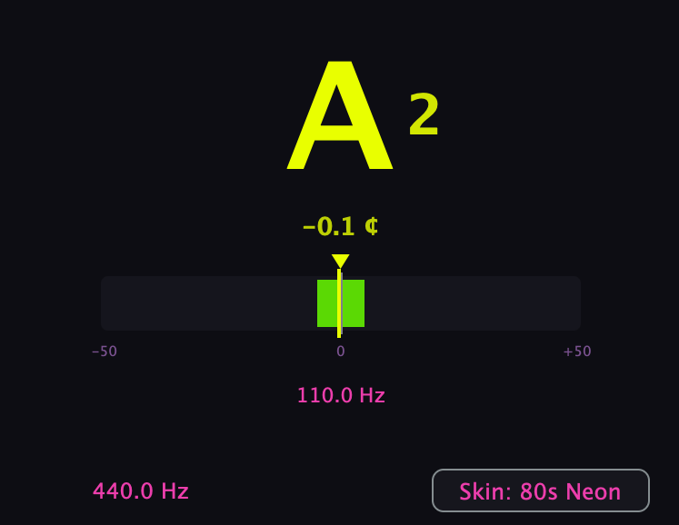

# Modfinger Tuner

A real-time, monophonic **chromatic tuner** audio plugin built with [JUCE](https://juce.com/).
It uses the **pYIN** probabilistic pitch detector (Mauch & Dixon, 2012 — a Viterbi‑smoothed
upgrade of the YIN algorithm) to detect pitch from an incoming audio signal and displays
the note, octave, and a cents-tuning meter.

Available as **VST3**, **AU**, and a **Standalone** app (macOS).



---

## Requirements

| Dependency | Notes |
|------------|-------|
| **CMake ≥ 3.22** | Build system. |
| **C++17 compiler** | Apple Clang (Xcode Command Line Tools) on macOS · MSVC (Visual Studio 2019/2022 with the "Desktop development with C++" workload) on Windows · GCC or Clang on Linux. |
| **JUCE** | Bundled as a git submodule at `JUCE/` (pinned to **8.0.12**). See below. |
| **Linux system libraries** *(Linux only)* | JUCE's GUI/audio need dev headers. On Debian/Ubuntu: `sudo apt install libx11-dev libxext-dev libxinerama-dev libxrandr-dev libxcursor-dev libxcomposite-dev libfreetype6-dev libfontconfig1-dev libasound2-dev`. (This plugin disables curl/web, so those aren't needed.) |
| **Network access** | Only on first configure if tests are enabled (Catch2 is fetched via CMake `FetchContent`). Pass `-DMODFINGER_BUILD_TESTS=OFF` to build offline. |

### JUCE (bundled submodule)

JUCE is bundled as a git submodule at `JUCE/` (pinned to JUCE **8.0.12**), so the repo is
self-contained. A plain clone is enough — **CMake initializes the submodule automatically**
on first configure whenever `JUCE/` is empty:

```sh
git clone <repo-url>
cmake -B build          # populates JUCE/ via `git submodule update --init`
```

Prefer to fetch it yourself, or building somewhere git/auto-init isn't available? Use either
of these instead:

```sh
git clone --recurse-submodules <repo-url>   # fetch at clone time
# or, after a plain clone:
git submodule update --init --recursive
```

Disable the auto-init with `-DMODFINGER_AUTOINIT_SUBMODULES=OFF` (e.g. CI jobs that fetch
the submodule explicitly).

`CMakeLists.txt` builds JUCE from the bundled checkout:

```cmake
add_subdirectory(JUCE ${CMAKE_BINARY_DIR}/JUCE)
```

To use a different JUCE version, check out the desired tag inside `JUCE/` and commit the
updated submodule pointer (e.g. `cd JUCE && git checkout 8.0.x && cd .. && git add JUCE`).

---

## Project structure

```
modfinger-tuner/
├── CMakeLists.txt
├── AGENTS.md                     # Quick-reference for AI-assisted dev
├── JUCE/                         # JUCE 8.0.12 (git submodule)
├── skins/                        # JSON skin files (bundled defaults + templates to import)
├── docs/                         # Architecture docs (see docs/)
│   └── skins/                    # Extra importable skin files (copy into the user folder)
├── source/
│   ├── PluginProcessor.{h,cpp}   # AudioProcessor: mono sum, drives pYIN, pushes atomics
│   ├── PluginEditor.{h,cpp}      # Editor: display state machine, paint, skin selector
│   ├── dsp/
│   │   ├── Pitch.h               # Pure 12-TET helpers: note/octave/cents (JUCE-free, testable)
│   │   └── PyinDetector.{h,cpp}  # pYIN pitch detector (YIN core + Viterbi, JUCE-free, testable)
│   └── ui/
│       ├── TunerPalette.h        # Semantic colour slots for a skin
│       └── SkinLibrary.{h,cpp}   # Runtime JSON skin loader (bundled + user folder)
└── tests/
    ├── PitchTests.cpp            # Catch2 unit tests for pitch math
    ├── PyinDetectorTests.cpp     # Catch2 unit tests for the pYIN detector on generated sines
    └── ProcessorTests.cpp        # JUCE UnitTests: parameter range + state round-trip
```

The DSP (`PyinDetector`) and music-theory math (`Pitch`) are intentionally kept free of
JUCE dependencies so they can be unit-tested in isolation.

---

## Building

The same CMake commands work everywhere; only the generator/config and the available
formats differ. AU is **macOS-only** — JUCE skips it automatically on Windows/Linux, so
use `ModfingerTuner_VST3` and `ModfingerTuner_Standalone` there (or `ModfingerTuner_All`
on macOS for everything).

```sh
# Configure (from the project root)
cmake -B build -DCMAKE_BUILD_TYPE=Release          # macOS / Linux (Makefiles or Ninja)
#  Windows (Visual Studio generator is multi-config — omit -DCMAKE_BUILD_TYPE):
#  cmake -B build -G "Visual Studio 17 2022"

# Build a specific format
cmake --build build --target ModfingerTuner_VST3 --config Release -j      # VST3
cmake --build build --target ModfingerTuner_AU --config Release -j        # AU (macOS only)
cmake --build build --target ModfingerTuner_Standalone --config Release -j
```

> `--config Release` is required by multi-config generators (Visual Studio, Xcode) and
> ignored by single-config ones (Makefiles, Ninja), where you set the config at configure
> time with `-DCMAKE_BUILD_TYPE=Release`.

Built artefacts land under `build/ModfingerTuner_artefacts/…`:

| Generator | VST3 path |
|-----------|-----------|
| Makefiles / Ninja (macOS, Linux) | `ModfingerTuner_artefacts/Release/VST3/` |
| Visual Studio / Xcode (multi-config) | `ModfingerTuner_artefacts/VST3/` |

### Installing plugins

`COPY_PLUGIN_AFTER_BUILD` is `OFF`, so copy the bundles manually. VST3 destinations
(copy the whole `.vst3` bundle — it's a folder):

| OS | Per-user (no admin) | System |
|----|---------------------|--------|
| macOS | `~/Library/Audio/Plug-Ins/VST3/` | `/Library/Audio/Plug-Ins/VST3/` |
| Windows | `%LOCALAPPDATA%\VST3\` | `%PROGRAMFILES%\Common Files\VST3\` |
| Linux | `~/.vst3/` | `/usr/lib/vst3/` |

```sh
# macOS
cp -R "build/ModfingerTuner_artefacts/Release/VST3/Modfinger Tuner.vst3" \
      ~/Library/Audio/Plug-Ins/VST3/

# Linux
cp -R "build/ModfingerTuner_artefacts/Release/VST3/Modfinger Tuner.vst3" ~/.vst3/
```

```powershell
# Windows (PowerShell) — VS-generator artefact path has no Release\ segment
Copy-Item -Recurse "build\ModfingerTuner_artefacts\VST3\Modfinger Tuner.vst3" `
                    "$env:LOCALAPPDATA\VST3\"
```

**AU (macOS only):**

```sh
cp -R "build/ModfingerTuner_artefacts/Release/AU/Modfinger Tuner.component" \
      ~/Library/Audio/Plug-Ins/Components/
```

AU components may need `auval` validation before the host registers them.

**Standalone:** run the built app/executable directly from the artefacts folder — no
install step.

Then **fully restart your DAW** so it rescans.

---

## Tests

Two test suites, both run via CTest:

```sh
cmake --build build --target ModfingerTunerTests ModfingerTunerJuceTests -j
ctest --test-dir build --output-on-failure
```

| Target | Framework | Covers |
|--------|-----------|--------|
| `ModfingerTunerTests` | Catch2 (fetched) | Pure logic: `pitch` note/cents math and `PyinDetector` on generated sines. JUCE-free. |
| `ModfingerTunerJuceTests` | JUCE `UnitTest` | JUCE-coupled seams: `reference` parameter range/default and the state save/restore round-trip. |

Options (both on by default):

- `-DMODFINGER_BUILD_TESTS=OFF` — skip the Catch2 suite (avoids the network fetch for offline/minimal builds).
- `-DMODFINGER_BUILD_JUCE_TESTS=OFF` — skip the JUCE suite (needs only JUCE, builds offline).

---

## How it works

1. **Mono sum** — stereo input is averaged to mono in `processBlock`.
2. **pYIN detection** — a 4096-sample ring buffer is analyzed every 1024 samples (~43 Hz).
   The YIN difference function (windowed, unrolled into contiguous order) → CMND →
   candidate extraction (≤5 voiced periods) → 12‑frame HMM / Viterbi decoding yields
   the fundamental frequency and an aperiodicity score. The Viterbi smooths continuity
   and rejects octave errors.
3. **Cross-thread hand-off** — only `frequency` and `aperiodicity` (both
   `std::atomic<float>`) are written on the audio thread.
4. **UI** — a 25 Hz timer smooths the frequency on the message thread and derives the note
   name, octave, and cents via the pure `pitch` helpers, then repaints.

> **Note name / octave / cents are computed on the UI thread** from the atomic frequency.
> This keeps the audio→UI interface lock-free and race-free (no `juce::String` crosses
> threads).

---

## Configuration

| Parameter | Range | Default | Description |
|-----------|-------|---------|-------------|
| `reference` | 415–466 Hz | 440 Hz | A4 reference frequency used for note/cents mapping. Editable via the Hz label. |

Plugin state (parameter values and the active skin name) is saved/restored via the host.

### Skins

Colours are **data-driven at runtime** from JSON skin files — no recompile needed to add
one. Two defaults are bundled into the binary; imported skins live in a per-user folder:

- macOS: `~/Library/Application Support/ModfingerTuner/skins/`
- Windows: `%APPDATA%\ModfingerTuner\skins\`
- Linux: `~/.config/ModfingerTuner/skins/`

Open the **"Skin: …"** button (bottom-right) to switch, or use **Import skin…** /
**Open skins folder…**. An imported (or folder-dropped) skin appears the next time the
menu opens — the menu rescans on every open.

Skin file schema (colours are `0xAARRGGBB` hex strings):

```json
{
  "name": "80s Neon",
  "colors": {
    "background": "0xff0a0a12",
    "panel":      "0xff15151f",
    "primary":    "0xffeaff00",
    "secondary":  "0xffff2db3",
    "muted":      "0xff8a5a9a",
    "zoneLit":    "0xff39ff14",
    "zoneIdle":   "0xff1a7a14",
    "marker":     "0xff8a8a96"
  }
}
```

| Slot | Used for |
|------|----------|
| `background` | plugin background |
| `panel` | cents-bar track, label edit background |
| `primary` | note letter, needle, cents number |
| `secondary` | frequency readout, reference label |
| `muted` | "listening…", markings, non-confident note |
| `zoneLit` / `zoneIdle` | in-tune band when the needle is inside / otherwise |
| `marker` | center tick |

The active skin is stored **by name** in plugin state (not a host parameter), so the skin
set can be dynamic. A user skin with the same `name` as a bundled one overrides it. The
defaults ship as `skins/dark.json` and `skins/eighties_neon.json` (bundled via CMake
`juce_add_binary_data`).

Extra importable skin files live in `docs/skins/` — copy one into your user folder to
try it. Architecture docs (threading, testing, skin system) live in `docs/`.

---

## Troubleshooting

- **DAW shows an old UI after rebuilding** — fully quit and reopen the DAW (or remove and
  re-add the plugin). Hosts cache plugin instances.
- **"ad-hoc signature" warnings on macOS** — builds are ad-hoc signed; they run locally but
  are not notarized. Adjust signing in `CMakeLists.txt` (`JUCE_SIGN_INTERNALLY`/notarization)
  for distribution.
- **CMake can't find JUCE** — CMake normally initializes the submodule itself; this only
  happens if auto-init is disabled or git isn't available. Run
  `git submodule update --init --recursive` (see *JUCE (bundled submodule)*).
- **`Modfinger Tuner.vst3: No such file` when installing** — artefacts are under
  `build/ModfingerTuner_artefacts/Release/...` with the Makefiles generator; adjust the copy
  path accordingly.
- **First configure needs network** — Catch2 is fetched for tests. Use
  `-DMODFINGER_BUILD_TESTS=OFF` to skip.

---

## License

Licensed under the [MIT License](LICENSE). Copyright © 2026 Gregory Buchenberger.
